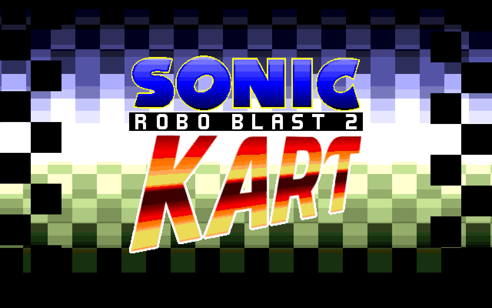

<p align="center">
  
</p>

<p align="center">
  Run a <a href="https://hyuu.cc">Sonic Robo Blast 2 Kart</a> dedicated server in Docker. Drop in mods, restart, done.
</p>

<p align="center">
  <a href="https://github.com/ebears/srb2kart-docker/pkgs/container/srb2kart-docker"></a>
  <a href="https://github.com/ebears/srb2kart-docker/actions"></a>
</p>

---

## Quick Start

Pick a directory for your server, then clone this repo (or just grab `docker-compose.yml`):

```bash
mkdir ~/kart-server && cd ~/kart-server
git clone https://github.com/ebears/srb2kart-docker.git .
docker compose up -d
```

A default server config is copied to `data/.srb2kart/kartserv.cfg` on first run. Edit it to customize your server.

<p align="center">
  
</p>
<details>
<summary>Using plain Docker (without Compose)</summary>

```bash
docker run -d \
  --name kart \
  -p 5029:5029/udp \
  -v ./mods:/mods \
  -v ./data:/data \
  ghcr.io/ebears/srb2kart-docker:latest
```

Run this from the directory where you want server data to live -- `./mods` and `./data` are relative paths and will be created automatically.

</details>

---

## Mods

Place `.kart`, `.wad`, `.pk3`, `.soc`, `.lua`, or `.cfg` files in the `mods/` directory. They load automatically on startup.

```bash
cp my-mod.kart mods/
docker compose restart
```

## Custom Arguments

Pass extra arguments via Compose:

```yaml
services:
  kart:
    image: ghcr.io/ebears/srb2kart-docker:latest
    command: ["-maxplayers", "16"]
```

Or with `docker run`:

```bash
docker run -d -p 5029:5029/udp ... ghcr.io/ebears/srb2kart-docker:latest -maxplayers 16
```

## Version Pinning

Images are tagged with the SRB2 Kart version. Pin to a release:

```yaml
image: ghcr.io/ebears/srb2kart-docker:v1.6
```

The `latest` tag tracks the most recent release.

## Building from Source

```bash
docker build -t srb2kart-docker .
docker build --build-arg KART_VERSION=v1.6 -t srb2kart-docker .
```

Then set `KART_IMAGE=""` and uncomment the `build:` block in `docker-compose.yml`:

```bash
KART_IMAGE="" docker compose up -d --build
```

---

## Volumes

| Mount | Purpose |
|-------|---------|
| `/mods` | Mods (`.kart`, `.wad`, `.pk3`, etc.) loaded automatically via `-file` |
| `/data` | Server home directory; config at `data/.srb2kart/kartserv.cfg` |

## Resource Limits

The default Compose file sets a **1 GB memory limit** and **2 CPU cores**, with `restart: unless-stopped`. The Dockerfile includes a healthcheck that verifies the `srb2` process is running (every 30s, 3 retries). Adjust `memory` and `cpus` in `docker-compose.yml` based on your player count and mods.

## Server Console

```bash
# Stream server output
docker compose logs -f kart

# Attach to the server console
docker attach kart          # Ctrl+P, Ctrl+Q to detach
```

> **Warning:** `Ctrl+C` while attached will stop the server. Use the detach sequence instead.

## Updating

```bash
docker compose pull
docker compose up -d
```

Your `data/` and `mods/` volumes are preserved across updates.

## Networking

SRB2 Kart uses **UDP port 5029**. Forward this port through your NAT/firewall so players can connect via your public IP or hostname.

---

## Troubleshooting

| Problem | Solution |
|---------|----------|
| Container exits immediately | `docker compose logs kart` -- usually a missing game data file or port conflict |
| Port already in use | Another process is using UDP 5029. Stop it or remap the host port (`"5030:5029/udp"`) |
| Mods not loading | Check file extensions (`.kart`, `.wad`, `.pk3`, `.soc`, `.lua`, `.cfg`) and logs for errors |
| `docker compose` not found | Install [Docker Compose v2](https://docs.docker.com/compose/install/), or use `docker-compose` (v1) |
| Server not visible | Verify port forwarding on your router and firewall rules for UDP 5029 |
| Build fails on game data | GitHub API rate limit reached. Wait or use a GitHub token |

## CI/CD

Pushes to `main` build and publish images to [GHCR](https://ghcr.io). Pull requests trigger validation builds (no push). Images are tagged with `latest`, the SRB2 Kart version, and the commit SHA. [Trivy](https://github.com/aquasecurity/trivy) vulnerability scanning runs on each push.
